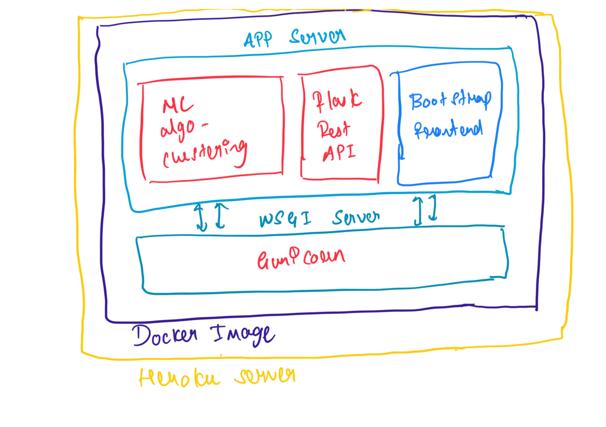

# ColorCode

### Hey There.! I am Sudeep Nellur back with another pet project after decade of procrastination(startup guy:cry:) called as *ColorCode*. This is a web app where you will upload an image and it will give you the color palette so that you don't have to stretch your head for the HEX code or RBG code of your favorite color out of the images you just saw.

Q) Now why it is used and who can benefit out of it? 
A) Anyone in the industry like UX/UI designer, Frontend developer, Photographer/Videographer, Fashion designer and folks in architecture.

Let's talk about the tech stack of the app.

The App got **Clustering ML algorithm** which will create the clusters for all similar colour and using the centroid of the each cluster we can fetch the HEX and RGB code. Then this app is exposed as APIs where it can be connected to the frontend later and here I have went with **Flask** as RestAPI framework. The visualisation is taken care via **Bootstrap** and user will be using the app via this. To make it as production grade ready I have added WSGI server using the **Gunicorn**. To finish it up all neat and good I have containerised the app by creating the **Docker Image** and this is simply made live **Heroku** cloud server.
 

### Some action time...!

**Check out the app yourself at📲: 
https://colorcodes.herokuapp.com/**

**Check out the app in your machine💻: 
https://github.com/Jairus313/ColorCode/packages/1402126**

**To collaborate with me🤝🏻: 
https://github.com/Jairus313/ColorCode**

**To contact me at📨: 
https://linkedin.com/in/sudeepnellur**

**Write to me at📧: 
sudeep.nellue.7@gmail.com**

### Thank you for reading and trying out the app and if you have any feedback, Please do leave it [here](https://docs.google.com/forms/d/e/1FAIpQLScWvBvKZVDETb8Cahxwaj8Yzgr9TIb7XVs-DwcxlYNwqkasVw/viewform?usp=sf_link) and if you want to contribute any then fork this repo and HMU a PR. Don't forget to :star: this repo and Keep Learning..!!
